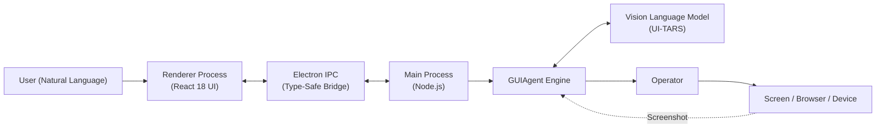
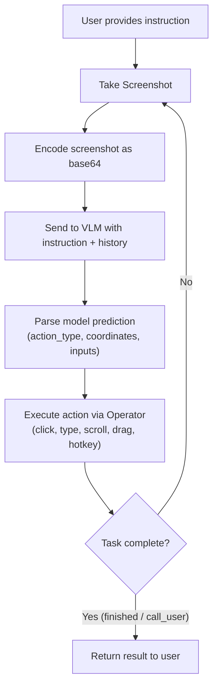
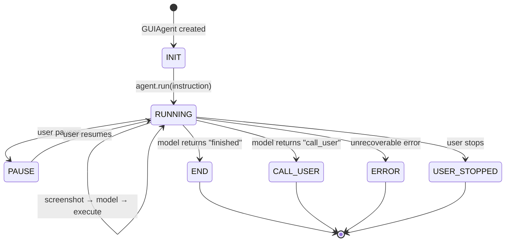
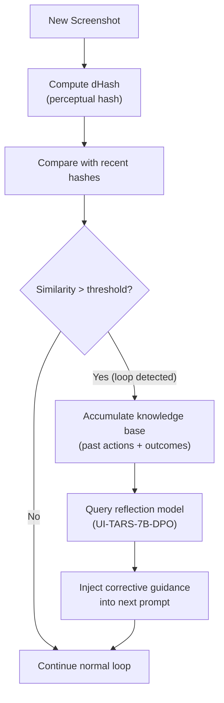
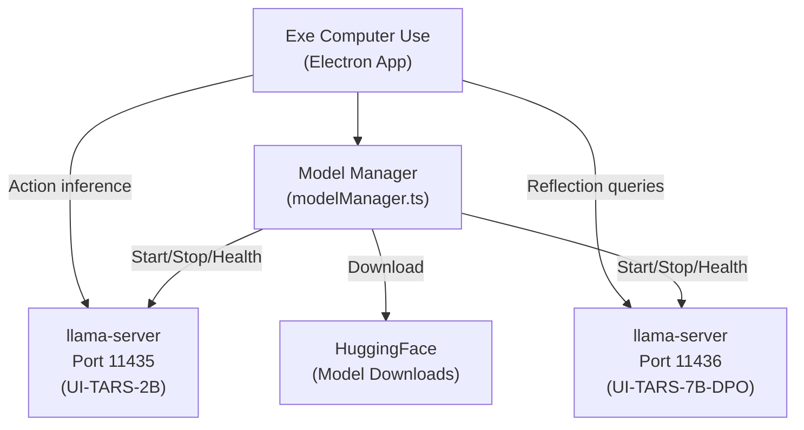

# Architecture

This document describes the system architecture of Exe Computer Use, including its component layout, data flow, and key design decisions.

## Table of Contents

- [System Overview](#system-overview)
- [Agent Loop](#agent-loop)
- [Monorepo Structure](#monorepo-structure)
- [Main Process Architecture](#main-process-architecture)
- [Renderer Architecture](#renderer-architecture)
- [Operator System](#operator-system)
- [Agent Loop Detail](#agent-loop-detail)
- [Reflection Memory Agent (RMA)](#reflection-memory-agent-rma)
- [Local Model Serving](#local-model-serving)

---

## System Overview

Exe Computer Use is an Electron 34 desktop application that follows the standard Electron architecture with a main process (Node.js) and a renderer process (React). The main process orchestrates the agent loop, manages model inference, and delegates actions to platform-specific operators.



## Agent Loop

The core automation cycle follows a closed-loop pattern: observe, reason, act, repeat.



## Monorepo Structure

The project is organized as a pnpm workspace monorepo, built with Turbo:

```
exe-computer-use/
├── apps/
│   └── ui-tars/                       # Electron desktop application
│       ├── src/main/                   # Main process
│       │   ├── agent/                  # Agent orchestration
│       │   ├── services/              # Core services
│       │   │   ├── runAgent.ts        # Agent execution service
│       │   │   ├── modelManager.ts    # Local model lifecycle
│       │   │   ├── windowManager.ts   # Window management
│       │   │   ├── settings.ts        # Settings persistence
│       │   │   └── rma/               # Reflection Memory Agent
│       │   │       ├── dHash.ts       # Perceptual hashing
│       │   │       ├── loopDetector.ts # Loop detection
│       │   │       ├── knowledgeBase.ts # Knowledge accumulation
│       │   │       └── reflectionService.ts # Reflection model client
│       │   ├── ipcRoutes/             # IPC route handlers
│       │   │   ├── agent.ts           # Agent control (start/stop/pause)
│       │   │   ├── model.ts           # Model management
│       │   │   ├── screen.ts          # Screen capture
│       │   │   ├── browser.ts         # Browser operator control
│       │   │   ├── permission.ts      # OS permission checks
│       │   │   ├── setting.ts         # Settings CRUD
│       │   │   └── window.ts          # Window management
│       │   ├── store/                 # Zustand state (main process)
│       │   └── window/                # Electron window creation
│       ├── src/renderer/              # Renderer process
│       │   └── src/
│       │       ├── App.tsx            # Root component
│       │       ├── pages/             # Route pages
│       │       ├── components/        # UI components
│       │       ├── store/             # Zustand bridge from main
│       │       ├── db/                # IndexedDB persistence
│       │       └── hooks/             # React hooks
│       └── src/preload/               # Context bridge
├── packages/ui-tars/                  # Core SDK and platform packages
│   ├── sdk/                           # GUIAgent engine
│   ├── shared/                        # Types, constants, utilities
│   ├── action-parser/                 # VLM output parser
│   ├── electron-ipc/                  # Type-safe IPC definitions
│   ├── operators/
│   │   ├── nut-js/                    # Desktop operator
│   │   ├── browser-operator/          # Browser operator (Puppeteer)
│   │   └── adb/                       # Android operator
│   ├── visualizer/                    # Action visualization
│   ├── utio/                          # UTIO utilities
│   └── cli/                           # CLI interface
├── packages/agent-infra/              # Agent infrastructure
│   ├── browser/                       # Browser control
│   ├── mcp-client/                    # MCP client
│   ├── mcp-servers/                   # MCP servers
│   ├── logger/                        # Logging infrastructure
│   └── shared/                        # Shared infrastructure utilities
└── configs/                           # Shared build/lint configs
```

## Main Process Architecture

The main process is the brain of the application. It manages the agent lifecycle, handles IPC communication with the renderer, and coordinates model inference with action execution.

### Services

| Service | File | Responsibility |
|---------|------|----------------|
| `runAgent` | `services/runAgent.ts` | Instantiates and runs the GUIAgent with the selected operator |
| `modelManager` | `services/modelManager.ts` | Manages local llama-server processes (start, stop, health check, download) |
| `windowManager` | `services/windowManager.ts` | Creates and manages Electron BrowserWindows |
| `settings` | `services/settings.ts` | Reads/writes persistent settings via electron-store |
| `rma` | `services/rma/` | Reflection Memory Agent: loop detection, knowledge base, reflection |

### IPC Routes

All communication between main and renderer uses type-safe IPC channels defined in `@ui-tars/electron-ipc`:

| Route | Channel Prefix | Purpose |
|-------|---------------|---------|
| `agent` | `agent:*` | Start, stop, pause, resume the agent |
| `model` | `model:*` | Local model management (download, start, stop, status) |
| `screen` | `screen:*` | Screen capture and display information |
| `browser` | `browser:*` | Browser operator lifecycle |
| `permission` | `permission:*` | OS permission queries (accessibility, screen recording) |
| `setting` | `setting:*` | Read/write application settings |
| `window` | `window:*` | Window state management |

### State Management

The main process maintains application state using Zustand. This state is bridged to the renderer through a sanitized IPC channel -- the renderer receives a read-only projection of the main process state, ensuring the UI always reflects the current agent status, settings, and session data.

## Renderer Architecture

The renderer process provides the user interface.

| Layer | Technology | Purpose |
|-------|-----------|---------|
| **Framework** | React 18 | Component rendering |
| **Routing** | HashRouter | Page navigation within Electron |
| **State** | Zustand (bridged) | Synchronized state from main process |
| **Persistence** | IndexedDB | Session history, chat logs |
| **Styling** | Tailwind CSS 4 + shadcn/ui | Component library and utility styles |
| **Build** | electron-vite + Vite 6 | Fast HMR in development |

The renderer does not directly invoke any agent logic or model calls. All actions are dispatched via IPC to the main process.

## Operator System

Operators are the abstraction layer between the agent and the target platform. Each operator implements the abstract `Operator` class from `@ui-tars/sdk`:

```typescript
abstract class Operator {
  static MANUAL: {
    ACTION_SPACES: string[];
    EXAMPLES?: string[];
  };

  abstract screenshot(): Promise<ScreenshotOutput>;
  abstract execute(params: ExecuteParams): Promise<ExecuteOutput>;
}
```

### Available Operators

| Operator | Package | Target | Technology |
|----------|---------|--------|-----------|
| **NutJS Operator** | `@ui-tars/operator-nut-js` | Desktop (mouse, keyboard, hotkeys) | nut-js native bindings |
| **Browser Operator** | `@ui-tars/operator-browser` | Web browsers | Puppeteer |
| **ADB Operator** | `@ui-tars/operator-adb` | Android devices | Android Debug Bridge |

Each operator provides:

- **`screenshot()`** -- Captures the current visual state and returns a base64-encoded image with scale factor information.
- **`execute(params)`** -- Performs a parsed action (click, type, scroll, drag, hotkey) on the target platform.
- **`MANUAL.ACTION_SPACES`** -- Declares the set of action types the operator supports, which is injected into the system prompt sent to the VLM so the model knows what actions are available.

## Agent Loop Detail

The `GUIAgent` class in `@ui-tars/sdk` implements the full agent loop.

### Lifecycle



### Model Invocation

The agent communicates with the VLM using an OpenAI-compatible chat completions API. Each iteration sends:

1. A **system prompt** containing the operator's action space definitions and usage examples.
2. The conversation **history** (previous screenshots and model responses).
3. The current **screenshot** encoded as a base64 image.

The model returns a text prediction in the format:

```
Thought: <reasoning about what to do>
Action: <action_type>(action_inputs)
```

### Action Parsing

The `@ui-tars/action-parser` package parses the model's text prediction into a structured `PredictionParsed` object:

```typescript
interface PredictionParsed {
  action_type: string;    // e.g., "click", "type", "scroll", "hotkey", "finished"
  action_inputs: {
    content?: string;     // Text to type
    start_box?: string;   // Starting coordinate
    end_box?: string;     // Ending coordinate (for drag)
    key?: string;         // Key to press
    hotkey?: string;      // Hotkey combination
    direction?: string;   // Scroll direction
  };
  thought: string;        // Model's reasoning
  reflection: string | null; // Model's self-reflection
}
```

### Retry Strategy

The agent uses `async-retry` with configurable retry counts for each phase:

| Phase | Default Max Retries | Purpose |
|-------|-------------------|---------|
| **Model invocation** | 5 | Handles transient API errors, rate limits |
| **Screenshot capture** | 5 | Handles screen capture failures |
| **Action execution** | 1 | Operator execution errors |

## Reflection Memory Agent (RMA)

The Reflection Memory Agent is a self-correction system that detects when the agent is stuck in a repetitive loop and intervenes to break it.



### Components

| Component | File | Purpose |
|-----------|------|---------|
| **dHash** | `dHash.ts` | Computes perceptual hashes of screenshots for fast similarity comparison |
| **Loop Detector** | `loopDetector.ts` | Compares consecutive screenshot hashes to detect repetitive states |
| **Knowledge Base** | `knowledgeBase.ts` | Accumulates action history and outcomes for context |
| **Reflection Service** | `reflectionService.ts` | Queries a separate reflection model to generate corrective guidance |

### How It Works

1. Each screenshot is converted to a **dHash** (difference hash) -- a compact perceptual fingerprint.
2. The **loop detector** compares recent hashes. If consecutive screenshots are too similar (indicating the agent is repeating the same actions with no progress), it triggers a reflection.
3. The **knowledge base** gathers the recent action history and provides context about what was attempted.
4. The **reflection service** sends this context to a separate model (typically UI-TARS-7B-DPO running on a dedicated port) which analyzes the situation and suggests a different approach.
5. The corrective guidance is injected into the agent's next prompt, steering it toward a new strategy.

## Local Model Serving

Exe Computer Use can run UI-TARS models locally using llama-server, a high-performance inference server.

### Architecture



### Server Lifecycle

1. **Download**: The model manager downloads the llama-server binary and model weights from HuggingFace.
2. **Start**: On app launch (if auto-start is enabled), the model manager spawns llama-server child processes for each configured model.
3. **Health Check**: The manager periodically pings `/health` on each server to verify readiness.
4. **Inference**: The app sends OpenAI-compatible API requests to `http://localhost:11435/v1/chat/completions` for action inference and `http://localhost:11436/v1/chat/completions` for reflection.
5. **Stop**: When the app closes or the user disables local models, the child processes are terminated.

### Port Configuration

| Server | Default Port | Purpose |
|--------|-------------|---------|
| Main model | `11435` | Primary VLM for action prediction |
| Reflection model | `11436` | Reflection model for loop-breaking (RMA) |

Both ports are configurable in Settings. See the [Configuration Reference](./configuration.md) for details.
